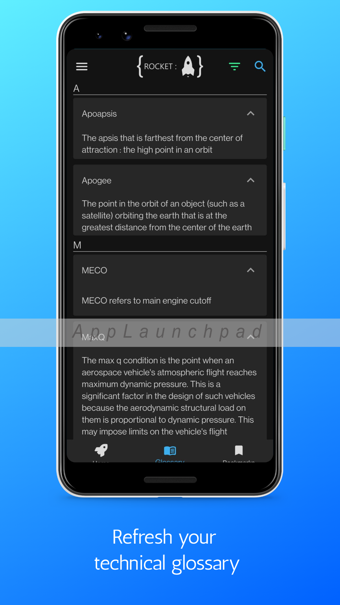

# Rocket Dictionary

Rocket Dictionary is as the name says a rocket dictionary, users can search through all the rockets ever made and in development in the app. It was developed using [Express](https://expressjs.com/) in the backend and [Flutter](https://flutter.dev/) as the frontend choice.

Backend crawls the [wikipedia page - Comparison_of_orbital_launch_systems](https://en.wikipedia.org/wiki/Comparison_of_orbital_launch_systems) for all available rocket names and then extract data from their respective wiki pages, saves the data in Mongo DB and serves to the Frontend client

## Screenshots

## License

[MIT](https://choosealicense.com/licenses/mit/)
